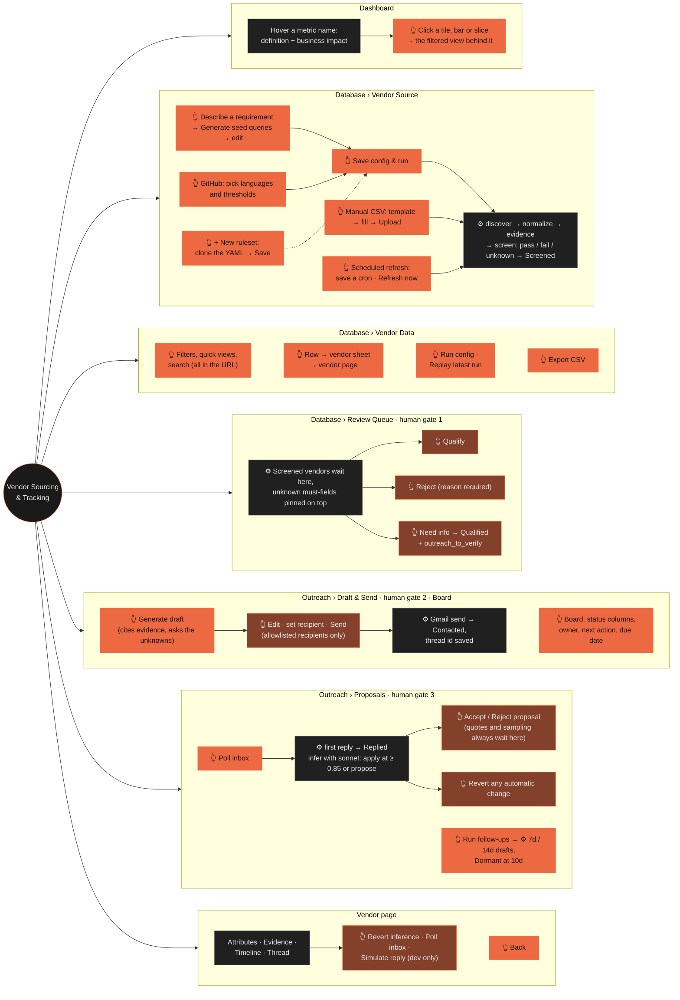
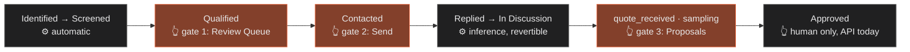
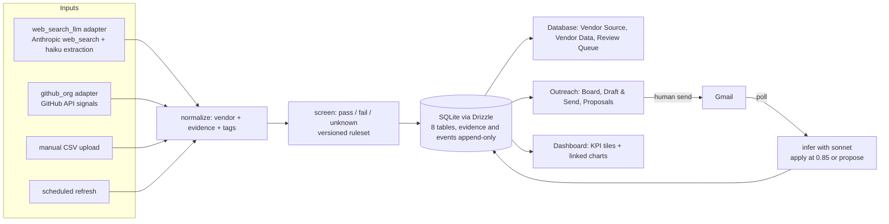

# Abaka AI - Vendor Sourcing & Tracking System (VSTS)

Why: 
1. Finding potential qualifying vendors that meet different customer needs are difficult
2. Managing vendor data and relationships at scale without a structure is hard
3. Tracking bulk vendor communication and lifecycle manually is impossible

How:
1. A vendor sourcing tool with customizable requirements for different discovery channel.
* Custom web search, Github search, Manual CSV upload, etc.
3. A vendor database filters to locate data faster, expandable vendor information for detail view, and review queue for action items.
* Vendor Source, Vendor Data, Review Queue
3. A vendor outreach tool with overview on vendor lifecycle, built-in email connector with AI generated draft for one-click send, and LLM powered response and proposal from email conversation, with human authorization as necessary.
* Board, Draft & Send, Proposals

What: An end-to-end system that sources potential vendors, manages existing vendors, and tracks vendor supply chain at scale.

Product spec: [docs/PRD.md](docs/PRD.md).

## User Flow

* Orange nodes are clicks.
* Brown nodes happen on their own.
* Dark orange nodes are the human gates, the clicks that change a vendor's status.




Vendor Relationship Life Cycle



Everything between the gates is logged as an event with its actor and reason, and any automatic change can be reverted with one click.

## System Architecture



**One config + one ruleset per category**
* `configs/<name>.yaml` says which adapter to run and how (seed queries or GitHub filters); `rulesets/<name>.vN.yaml` lists the must-fields with thresholds, the should-fields, and the extraction catalog.
* Adding a category is two YAML files.

**Every value carries evidence.** 
* Adapters return `evidence` rows with a source URL and a verbatim snippet; the extraction step discards any value whose snippet is not found on the fetched page.
* Only verified rows are promoted to `vendors.attributes` and tagged with a verified badge.
* Manual uploads are verified only with a URL or the uploader's attestation.

**Screening is three-valued and pure.** 
* `screen(vendor, evidence, ruleset)` returns pass when every must-field passes, fail when a verified value fails a threshold, and unknown when a must-field has no verified evidence.
* Unknown never rejects; it sets `next_action = outreach_to_verify`, and the outreach draft asks about exactly those fields.

**Status changes only through the event log.** 
* `transition()` validates the PRD §6 whitelist and appends an `events` row; `rebuildStatus()` replays the log and throws on mismatch.
* Only Identified → Screened and Contacted → Replied are automatic.
* Inference from replies auto-applies at confidence ≥ 0.85, never for quote or sample stages, and every automatic change has a one-click Revert.
* Refresh diffs are recorded as informational events that do not change status.

**Cost control.** 
* Extraction and classification run on claude-haiku-4-5, drafting and inference on claude-sonnet-5.
* Every run persists raw payloads to `data/runs/<run_id>/`; a replay re-extracts from disk without searching, and development/test runs are capped at 5 candidates.

### Code map

| Path | Role |
|---|---|
| `src/lib/db` | schema (8 tables), client, `state.ts` (transitions, replay, informational events), filters, metrics, queries, CSV export |
| `src/lib/shared` | client-safe helpers: filter params, section redirects, must-field definition, env, email, HTTP, default rulesets |
| `src/lib/pipeline` | adapter contract and zod schemas, `screen.ts`, `run.ts` (discover → normalize), `write.ts` (plan → apply → finalize), `refresh.ts`, `manual.ts`, replay storage, cron |
| `src/lib/adapters` | `webSearchLlm.ts`, `githubOrg.ts` |
| `src/lib/rulesets` | YAML loaders for configs and rulesets, config and ruleset writers |
| `src/lib/llm` | Anthropic client with per-task model routing, page fetcher |
| `src/lib/outreach` | Gmail OAuth, `send.ts` (the human send gate), drafts, recipient allowlist |
| `src/lib/track` | inbound polling, status inference, proposal decisions, follow-ups |
| `src/app/(app)` | Dashboard; Database (`sources`, `vendors`, `review`); Outreach (`board`, `draft`, `proposals`); `/vendors/[id]` |
| `src/components` | sidebar and nav items, shadcn primitives, `dashboard/charts.tsx`, database / outreach / vendor components |
| `src/app/api` | route handlers: runs, refresh, schedules, inputs, rulesets, configs, vendors, proposals, gmail, track, export |
| `configs/`, `rulesets/` | the three P0 categories |
| `tests/` | unit and integration tests, reply fixtures, CSV fixture |

## MVP Limitation

This MVP is a continuous Node process with a writable disk: the SQLite file, `data/runs/`, `token.json` from the OAuth callback, and YAML configs and rulesets written from the Vendor Source page. 
* Discovery, refresh and polling run inside the process (`after()`), and a restart marks unfinished runs failed at boot.
* This is not a serverless or multi-instance shape; put `APP_PASSWORD` in front of it before it leaves localhost.

## Setup

Requires Node 22.9 or later (`better-sqlite3` ships prebuilt binaries for current Node releases; older versions need a C++ toolchain).

```bash
npm install
cp .env.example .env.local   # fill in the keys below
npm run seed:sample          # 27 fictional vendors so every page has data
npm run dev                  # http://localhost:3000
```

The SQLite database is created and migrated on first use at `data/vendor-sourcing.db`. Raw payloads of every run land in `data/runs/<run_id>/`.

### `.env.local` keys

| Key | Used for |
|---|---|
| `ANTHROPIC_API_KEY` | web search discovery and extraction (claude-haiku-4-5), seed queries, email drafts and reply inference (claude-sonnet-5) |
| `GITHUB_TOKEN` | the `github_org` adapter; read access to public repositories is enough |
| `GMAIL_CREDENTIALS_PATH` | path to the Google OAuth desktop-client JSON, default `./credentials.json` (client: `@googleapis/gmail`) |
| `DEMO_ALLOWED_RECIPIENTS` | comma-separated addresses outreach may send to; anything else is rejected server-side |

Optional: `APP_PASSWORD` puts HTTP Basic auth in front of every page and API route (any username; cron callers use `curl -u :password`), which you want before the app is reachable beyond localhost. `ANTHROPIC_MODEL` forces one model for every task (testing only), `LLM_DISCOVER_EFFORT` / `LLM_EXTRACT_EFFORT` tune effort on models that support it, `DATABASE_PATH` moves the SQLite file.

### Gmail

1. In Google Cloud create an OAuth client of type **Desktop app**, enable the Gmail API, and add your Google account as a test user while the consent screen is in Testing mode.
2. Download the client JSON to `credentials.json` in the repo root (gitignored).
3. Start the app, open **Outreach → Draft & Send** and click **Connect Gmail**. The callback at `/api/gmail/callback` writes `token.json` (gitignored). Scopes: `gmail.send` and `gmail.readonly`.
4. Add the inbox you will test with to `DEMO_ALLOWED_RECIPIENTS` and restart `npm run dev`.

## Runs, replay and cost control

- Every run writes a `runs` row with its `ruleset_version` and persists raw payloads.
- Outside a production build the discovery limit defaults to 5 candidates; pass `limit` in `POST /api/runs` to override up to the config's own limit.
- `POST /api/runs { config, replay: true }` (or the **Replay latest run** checkbox) re-extracts the latest finished run's persisted candidates without searching again.
- A new vendor category is one `configs/<name>.yaml` plus one `rulesets/<name>.vN.yaml`; the Vendor Source page writes web-search and GitHub configs for you, and the **+** next to any ruleset selector clones a ruleset into a validated new file (`POST /api/rulesets`).

## Tracking replies

- `POST /api/track/poll` fetches new inbound Gmail messages for every active thread, stores them as interactions, moves Contacted → Replied on the first reply, then runs inference.
- Transitions auto-apply at confidence ≥ 0.85 except `quote_received` and `sampling`, which always wait in **Outreach → Proposals**.
- Any automatic change can be reverted with one click.
- `POST /api/track/simulate { vendor_id, subject, body }` injects an inbound reply without Gmail (development only) for demos.
- `npm run test:replies` runs the ten-case reply set in `tests/replies/` through inference and reports accuracy (target ≥ 8/10) and which cases route to Proposals.

### Scheduled refresh, follow-ups and export (P1)

- `POST /api/refresh { config, vendor_ids?, limit? }` re-fetches the evidence pages of each vendor discovered by that config's adapter, re-extracts, writes new evidence through the normal path and records `tag_changed` / `screen_changed` events (actor=system) on the vendor Timeline.
- A changed screen result on a vendor past Screened sets `next_action=re_review`, which the Review Queue lists on top.
- Development refreshes are capped at 5 vendors.
- **Vendor Source → Scheduled refresh** stores one cron per config in the `schedules` table (5-field cron, UTC, presets in the picker) with a **Refresh now** button.
- Nothing runs by itself: an external cron calls `POST /api/schedules/run-due`, which runs every enabled schedule whose cron fired since its last run and records `last_run_id`. Example crontab entry:

  ```
  */15 * * * * curl -s -X POST http://localhost:3000/api/schedules/run-due
  0 * * * *    curl -s -X POST http://localhost:3000/api/track/poll
  0 8 * * *    curl -s -X POST http://localhost:3000/api/track/followups
  ```

- `POST /api/track/followups` drafts a follow-up (sonnet) for Contacted vendors 7 days after the last outbound with no reply, moves them to Dormant at 10 days (system event) and drafts a last touch at 14 days. Follow-up drafts appear in **Outreach → Draft & Send**; sending them goes into the existing Gmail thread without a status change. Outside production the body may carry `as_of` to simulate elapsed time.
- **Database → Vendor Data → Export CSV** downloads the current filtered view (`GET /api/export?<filters>`) with one column per tag dimension.

## Scripts

| Command | What it does |
|---|---|
| `npm run dev` / `build` / `start` | Next.js |
| `npm test` | unit and integration tests (state machine, screening, write path, filters, CSV, outreach, tracking, refresh, cron, follow-ups, rulesets, navigation, timeline) |
| `npm run typecheck` / `npm run lint` | `next typegen && tsc --noEmit`; eslint. CI runs both, then the tests and a production build |
| `npm run test:replies` | reply inference accuracy on `tests/replies/*.json` |
| `npm run seed:sample` | idempotent fictional sample data (`.example` domains) |
| `npm run verify:run [run_id]` | acceptance checks for a run: counts, evidence coverage, no unverified attributes, no duplicates, event replay |
| `npm run db:generate` / `db:studio` | Drizzle migrations and browser |

## Tools & Functions Definition

1. **Dashboard** — KPI tiles and charts: sourcing funnel, screening donut, coverage by type, reply rate, backlog, discovery runs, source, country. Click a tile, bar or slice to land in the filtered view; hover a metric name for its definition and why it matters.
2. **Database → Vendor Data** — filters live in the URL; open a row for evidence with verbatim snippets and source links, tags with source badges.
3. **Database → Vendor Source** — describe a requirement, **Generate seed queries**, **Save config & run** (5 candidates in dev; buttons say why they are disabled until the form is ready), or run `ego_data_stereo` from Vendor Data, or replay the last run; upload the 5-row CSV from `tests/fixtures/manual_ego_sample.csv` and watch badges (manual, attested, unknown).
4. **Database → Review Queue** — Qualify one pass, Reject one fail with a reason, Need info one unknown.
5. **Outreach → Draft & Send** — pick the Need-info vendor; the draft cites verified facts and asks about the unknown field; edit, send to the allowlisted inbox; the vendor becomes Contacted with a thread id.
6. **Outreach → Proposals** — reply from the test inbox (or simulate one): Replied is automatic, a plain "let's talk" auto-applies In Discussion, a quote waits for Accept; Revert undoes any automatic change. **Run follow-ups** drafts nudges for silent vendors and parks them as Dormant after 10 days.
7. **Vendor page** — Attributes with badges, Evidence, Timeline as a vertical rail of status milestones and emails (every actor and reason, refresh diffs, Revert on inference), Thread; **Back** returns to wherever you came from.
8. **Vendor Source → Scheduled refresh** — Refresh now on a config; the Timeline shows what changed. **Export CSV** on Vendor Data downloads the filtered view.

## Improvements/Upgrades

The five changes with the highest return, in order.

**Registry lookup for company facts**
- Action: add an adapter that reads registration and ownership country from public company registers, with the register page as the evidence URL, through the same normalize → evidence → screen path as every other source.
- Impact: the unknown rate drops, fewer emails are sent only to verify facts, and more vendors reach the shortlist on the day they are found.

**Structured quotes**
- Action: when a reply carries pricing, extract price, unit, minimum order and licence terms into fields on the interaction and show them on the Board and the vendor page.
- Impact: offers become comparable side by side, and the approval decision is made from a table instead of a pile of emails.

**Evidence expiry**
- Action: give each verified value a shelf life per field, mark expired evidence as stale, and let the refresh job prioritise expired must-fields on vendors already in the pipeline.
- Impact: the team never acts on a fact that quietly went out of date, and refresh spend goes only where it matters.

**Self-running jobs**
- Action: move discovery, refresh, polling and follow-ups into a scheduler inside the app, with a job table and retries, replacing the external cron.
- Impact: replies are picked up and follow-ups go out without anyone pressing a button, and a restart no longer loses work.

**Learn from outcomes**
- Action: report which seed queries, source channels and screening rules produced vendors that reached Approved, from the runs and events tables already recorded.
- Impact: each sourcing round is cheaper and better targeted than the last, because spend goes to the queries and channels that convert.
